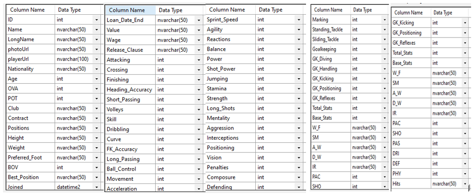
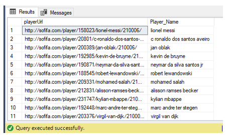
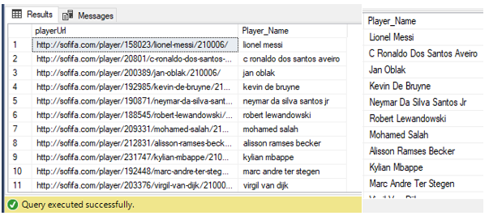
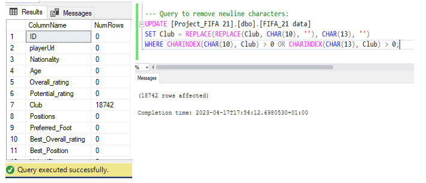

# Data Cleaning Project In SQL - FIFA '21


## Introduction


[Photo Credit](https://encrypted-tbn0.gstatic.com/images?q=tbn:ANd9GcR05_U8KUYx3dqBvZBCqgHHdaqWEhSFONgQ_Q&usqp=CAU)

Data is everywhere, but it's usually unfit in its raw state to be used to draw insights that solve business problems. Hence, when data is collected, it is expedient for it to be cleaned. Having a clean data increases overall productivity and allow for the highest quality of information in decision-making. 
As one who has been taking courses on the Data Analytics learning path, I decided to carry out a Data Cleaning Project using SQL to flex my Data skills.
Some of the objectives of this project includes:
- Checking for misspellings, duplicate entries etc. and working on them as appropriate
- Ensuring that each column has the correct datatype
- Removal of irrelevant/redundant entries.

The overall goal is to have a clean data that is fit for further analysis, which will aid us to draw accurate and meaningful insights from it.

## About the data
The data was gotten from [Kaggle](https://www.kaggle.com/datasets/yagunnersya/fifa-21-messy-raw-dataset-for-cleaning-exploring). The raw data is quite messy, making it Ideal for a data cleaning project.
The data is in a CSV file format that consists of **18,979 rows and 77 Columns**. In this repository you will find the dataset before cleaning and the dataset after cleaning. Below is an overview of the columns and datatype before cleaning.



## Data Cleaning
To begin the cleaning process, the dataset was imported into Microsoft SQL Server Management Studio.
Having imported the data, I checked for presence of duplicates using the query below. 

```Tsql 
SELECT ID, Name,
     COUNT(*) AS "Count"
FROM [Project_FIFA 21].[dbo].[FIFA_21 data]
  GROUP BY ID, Name
  HAVING COUNT(*) > 1
  ORDER BY ID;
``` 

The  query selects the ID and Name columns, which are expected to be unique, from "FIFA_21 data" table.  It then groups the results by the ID and Name columns, and counts the number of rows in each group. It then only includes groups where the count is greater than 1 using the `HAVING` clause. Finally, the results are ordered by the ID column. No column had a count greater than one, indicating that there are no duplicates.
 Let's now move to cleaning columns in the dataset as required

### ID column
No cleaning was needed as contents are Unique, void of errors, and has the correct data type.

### Name, LongName, playerUrl 
 These had information about the names of the players. Name column contains initials of players, LongName Column contains players' full names, but had misspelling issues while the playerUrl column had links to websites having the players' information. These links' text had the players' correct names. A new column, "Player_name" was created and names of the players were extracted from the playerUrl column into it.  This I did by using a combination of `SUBSTRING`, `LEN`, `CHARINDEX`, `LEFT`, and `REPLACE` functions to remove delimeters and extract the players' names from the playerUrl column. `TRANSLATE` was used to replace  numeric characters in the column with 10 spaces, and `TRIM` was used to remove the spaces and any other one. The query used is shown below:
 
```Tsql
--- viewing the Name, LongName, and playerUrl fields
SELECT Name, LongName, playerUrl
FROM [Project_FIFA 21].[dbo].[FIFA_21 data];

--- Add new name column 'Player_Name'
ALTER TABLE [Project_FIFA 21].[dbo].[FIFA_21 data]
ADD Player_Name Varchar(100);

--update/extract from playerUrl based on forward slash ("/") delimeters
UPDATE [Project_FIFA 21].[dbo].[FIFA_21 data]
SET Player_Name = SUBSTRING(playerUrl,CHARINDEX('/',PlayerURL)+24,
          (LEN(playerUrl)- CHARINDEX('/',PlayerURL)-2));

SELECT playerUrl, Player_Name --- to check progress of the extraction process
FROM [Project_FIFA 21].[dbo].[FIFA_21 data];

--- Further extraction to remove delimiters
UPDATE [Project_FIFA 21].[dbo].[FIFA_21 data]
SET Player_Name = REPLACE(LEFT(Player_Name,LEN(Player_Name)-8),'/',' ');

UPDATE [Project_FIFA 21].[dbo].[FIFA_21 data]
SET Player_Name = REPLACE(Player_Name,'-',' ') --- hyphens should be replaced with spaces to create a more readable and consistent format for the player's name.

 --- Removing Numeric characters
UPDATE [Project_FIFA 21].[dbo].[FIFA_21 data]
SET Player_Name = TRIM(TRANSLATE(Player_Name,'0123456789','          '));

--- Checking that it worked
SELECT playerUrl,Player_Name
FROM [Project_FIFA 21].[dbo].[FIFA_21 data];
```

After the extraction, the names were all in lower cases and needed to be worked on further. 



To change from lower case to proper case, I first created custom function for Proper case, as its not a built-in function in SQL Server, then used it to change column to Proper case as shown below. The Name and LongName columns were dropped afterwards.

```Tsql
--- creating custom function for Proper case 
CREATE OR 
ALTER FUNCTION [dbo].[PROPER](@Text VARCHAR(5000)) RETURNS VARCHAR(5000) AS BEGIN
	DECLARE @Index INT;
	DECLARE @FirstChar CHAR(1);
	DECLARE @LastChar CHAR(1);
	DECLARE @String VARCHAR(5000);
		SET @String = LOWER(@Text);
		SET @Index = 1;
		WHILE @Index <= LEN(@Text)
BEGIN
	SET @FirstChar = SUBSTRING(@Text, @Index, 1);
	SET @LastChar = CASE WHEN @Index = 1
		THEN ' ' ELSE SUBSTRING(@Text, @Index - 1, 1)
	END;
	IF @LastChar IN(' ', ';', ':', '!', '?', ',', '.', '_', '-', '/', '&', '''', '(', '#', '*', '$', '@')
BEGIN
IF @FirstChar != ''''
OR UPPER(@FirstChar) != 'S'
SET @String = STUFF(@String, @Index, 1, UPPER(@FirstChar));
	END;
SET @Index = @Index + 1;
	END;
RETURN @String;
END;
GO

--- Using created custom function to change column to Proper case
UPDATE [Project_FIFA 21].[dbo].[FIFA_21 data]
SET Player_Name = [Project_FIFA 21].[dbo].[PROPER](Player_Name);

---confirming it worked
SELECT Player_Name
FROM [Project_FIFA 21].[dbo].[FIFA_21 data];

---removing name and LongName columns
ALTER TABLE [Project_FIFA 21].[dbo].[FIFA_21 data]
DROP COLUMN Name, LongName;
```

 
### Club
This holds the record of the name of each player's club. Some Clubs had 1 as a prefix before it's name. To resolve this, `REPLACE` function was used to replace any occurrences of the string "1." in the "Club" column with a space character, and the `TRIM` function used to remove any leading or trailing whitespace characters from the resulting string as shown in the query below.

```Tsql 
--- checking for presence of special/numeric characters
SELECT Club
FROM [Project_FIFA 21].[dbo].[FIFA_21 data]
  WHERE Club LIKE '%[@,#,$,%,*]%' OR Club LIKE '%1%';

--- Removing the '1.' from the club column
UPDATE [Project_FIFA 21].[dbo].[FIFA_21 data]
SET Club = TRIM(REPLACE(Club,'1.',' '));
```

### Height 
This contains the Players' Heights. However, the column had a wrong data type and contained inconsistent units - some in feet/inches while others were in Centimetres (cm). To achieve consistency, A new column, 'Height_Cm', with right data type "smallint" was created. To resolve the issue, a `CASE` statement was used  to convert height values in either feet and inches or just inches to a decimal value in centimeters. 
When the "height" column includes both feet and inches (e.g. "5'7""),  `SUBSTRING` function, in combination with `LEN` & `CHARINDEX`, is used to extract the numerical value of the feet (up to the first occurrence of a single quote) which is multiplied by the conversion factor, 30.48, for feet to centimeters. It further extracts the numerical value of the inches (between the single and double quotes), multiplies it by the conversion factor for inches to centimeters i.e 2.54, and adds it to the converted value of the feet. The `TRY_CONVERT` function is used to convert these values to decimal values with two decimal places, ensuring that the expression does not return an error.

Where the "height" column ends with just a double quote (e.g. "68""), the same approach as for inches in the previous step is used to convert it to centimeters.

If the "height" column does not end with either a double quote or the expected format for feet and inches (e.g. "176cm"), that is, the height value is already in centimeters, the numerical value is extracted, excluding the "cm" suffixes, for  ease of aggregation during further analysis. The old height column was dropped afterwards. Below is the query used.

```Tsql
ALTER TABLE [Project_FIFA 21].[dbo].[FIFA_21 data]
ADD Height_CM smallint --- Adding New column

--- Standardize the height column to same unit of measurement for uniformity
UPDATE [Project_FIFA 21].[dbo].[FIFA_21 data]
SET Height_CM = 
    CASE WHEN height LIKE '%''%"' 
THEN TRY_CONVERT(DECIMAL(10,2), SUBSTRING(height, 1, CHARINDEX('''', height)-1))*30.48 + 
 TRY_CONVERT(DECIMAL(10,2), SUBSTRING(height, CHARINDEX('''', height)+1, LEN(height)-CHARINDEX('''', height)-1))*2.54 
        WHEN height LIKE '%"' THEN TRY_CONVERT(DECIMAL(10,2), SUBSTRING(height, 1, LEN(height) - 2)) * 2.54 
        ELSE TRY_CONVERT(DECIMAL(10,2), SUBSTRING(height, 1, LEN(height) - 2)) 
    END;

---removing the messy Height Column 
 ALTER TABLE [Project_FIFA 21].[dbo].[FIFA_21 data]
DROP COLUMN Height;
```

### Weight
This contains record of the Players' weights. However, the column had a wrong data type and contained inconsistent units - some in pounds (lb) , others in Kilogramme (Kg). To achieve consistency, A new column, 'Weight_Kg', with the right data type, "smallint", was created. To resolve the issue, a `CASE` statement was used  to convert weight values in either kilograms (kg) or pounds (lbs) to a decimal value in kilogram aa shown in the query below.

```TSql
UPDATE [Project_FIFA 21].[dbo].[FIFA_21 data]
SET Weight_Kg = 
       CASE 
        WHEN Weight LIKE '%kg' THEN TRY_CONVERT(DECIMAL(10,2), SUBSTRING(Weight, 1, LEN(Weight) - 2))
        WHEN Weight LIKE '%lbs' THEN TRY_CONVERT(DECIMAL(10,2), SUBSTRING(Weight, 1, LEN(Weight) - 3)) * 0.45359237
        ELSE TRY_CONVERT(DECIMAL(10,2), SUBSTRING(Weight, 1, LEN(Weight) - 2)) 
    END;

---removing the messy Weight Column 
 ALTER TABLE [Project_FIFA 21].[dbo].[FIFA_21 data]
DROP COLUMN Weight;
```
If the "Weight" column ends with "kg", the `SUBSTRING` function extracts the numerical value of the weight (excluding the "kg" suffix), and converts it to a decimal value with two decimal places using `TRY_CONVERT` function.

If the "Weight" column ends with "lbs", `SUBSTRING` function, in conjunction with `LEN`, is used to extract the numerical value of the weight (excluding the "lbs" suffix), which is then  multiplied by the conversion factor for pounds to kilograms (i.e 0.45359237) and then converts it to a decimal value with two decimal places using the `TRY_CONVERT`.
If the "Weight" column does not end with either "kg" or "lbs", it's assumed that the weight value is already in kilograms and uses the same approach to extract and convert the numerical value. 

**_Note:_** _The `TRY_CONVERT` function is used to handle cases where the weight value cannot be converted to a decimal value, ensuring that the expression does not return an error._

### Joined
 This was in a date-time format. To standardize it, A new column, 'Joined_club', with "date" datatype was created. The `CONVERT` function was then used to convert the "Joined" column to a 'Date' data type. The Joined column was then dropped. Query is shown below:
 
```Tsql
ALTER TABLE [Project_FIFA 21].[dbo].[FIFA_21 data]
ADD Joined_Club Date; --- Add a new column for club joining date

UPDATE [Project_FIFA 21].[dbo].[FIFA_21 data]
SET Joined_Club = CONVERT(Date,Joined); 
 
ALTER TABLE [Project_FIFA 21].[dbo].[FIFA_21 data]
DROP COLUMN Joined; --- Remove the Joined column
```

### Contract & loan_date_end
 The contract column had inconsistent values and the wrong data type. The column has 3 categories of values in the format, '23rd July 2020 on loan’, 'Free' and '2018 ~ 2024’. The loan_date_end column had  many null values and dates in it are already captured in the contract column.
 To clean the contract column, 3 new columns were created -  Contract_Start_year, Contract_End_year, and Contract_Status. The `SUBSTRING` and `TRIM`functions, as well as the `LIKE` operator were used within a `CASE` statement to extract the start year of a contract, extract the end year of a contract, and to determine the status of the contract. If neither condition is met, the query returns "NULL" for the Contract_Start_year column and Contract_End_year column. In the case of Contract_Status column, the query returns "free". Afterwards, the contract and loan_date_end columns were then dropped. Query is shown below:
 
```TSql
SELECT Contract
FROM [Project_FIFA 21].[dbo].[FIFA_21 data]
WHERE Contract LIKE '%[@,#,$,%,*]%'; ---checking  for presence of special characters.

--- updating contract column delimeter from '~' to '-'
UPDATE [Project_FIFA 21].[dbo].[FIFA_21 data]
SET Contract = TRIM(REPLACE(Contract,'~','-'))

 --- Create new columns to extract contract details for better analysis
ALTER TABLE [Project_FIFA 21].[dbo].[FIFA_21 data]
ADD Contract_Start_year smallint, Contract_End_year smallint, Contract_Status Varchar(30);

--- updating the new columns 
UPDATE [Project_FIFA 21].[dbo].[FIFA_21 data]
SET Contract_Start_year = CASE WHEN Contract LIKE '%-%' THEN SUBSTRING(Contract,1,4)
				WHEN Contract LIKE '%Loan%' THEN SUBSTRING(Contract,9,4)
			    ELSE NULL 
				END;

UPDATE [Project_FIFA 21].[dbo].[FIFA_21 data]
SET Contract_End_year = TRIM(CASE WHEN Contract LIKE '%-%' THEN SUBSTRING(Contract,7,6)
				         WHEN Contract LIKE '%Loan%' THEN SUBSTRING(Contract,9,4)
				ELSE NULL END)

UPDATE [Project_FIFA 21].[dbo].[FIFA_21 data]
SET Contract_Status = CASE WHEN Contract LIKE '%-%' THEN 'Active'
			        WHEN Contract LIKE '%Loan%' THEN 'On Loan'
		               ELSE 'Free' END;

---Checking it worked
SELECT Contract,Loan_Date_End,Contract_Start_year, Contract_End_year,Contract_Status
FROM [Project_FIFA 21].[dbo].[FIFA_21 data];

---removing the Loan_date_end and contract column
ALTER TABLE [Project_FIFA 21].[dbo].[FIFA_21 data]
DROP COLUMN Contract,Loan_Date_End;
```

### Value, Wage, and Release_Clause
**Value** column contains the estimated market value of the player, **Wage** contains record of the player's current salary, while **Release_Clause** has the amount of money a team must pay to buy out a player's contract. However, these columns are denoted as string columns instead of numerical. This is due to the Currency sign "€" at the beginning of the numbers as well as  the "M" (for millions) and "K" (for thousands) suffix after the numerical characters. 

To resolve the issue,  the `LIKE` operator as well as the`REPLACE` and `TRY_CONVERT` functions were used within a `CASE` statement to conditionally update the values by converting them to a standard format in euros, making it easier to analyze. Thus, where Present, the query removes the '€' , 'M' and 'K' symbols, converts the remaining value to a decimal with two decimal places using the `TRY_CONVERT`  and multiplies it by 1000000 for 'M' or 1000 for 'K' as shown in the query below.

The column data types were then changed to the appropriate 'Integer' datatype and Columns were then renamed to have the currency context as part of their names.

```Tsql
--- viewing the columns
SELECT Value, Wage, Release_Clause
FROM [Project_FIFA 21].[dbo].[FIFA_21 data]

--- updating the columns
UPDATE [Project_FIFA 21].[dbo].[FIFA_21 data]
SET Value = CASE
    WHEN Value LIKE '€%' AND Value LIKE '%M' THEN TRY_CONVERT(DECIMAL(10,2), REPLACE(REPLACE(Value, '€', ''), 'M', '')) * 1000000
    WHEN Value LIKE '€%' AND Value LIKE '%K' THEN TRY_CONVERT(DECIMAL(10,2), REPLACE(REPLACE(Value, '€', ''), 'K', '')) * 1000
    WHEN Value LIKE '€%' THEN TRY_CONVERT(DECIMAL(10,2), REPLACE(Value, '€', ''))
    ELSE Value
END;

UPDATE [Project_FIFA 21].[dbo].[FIFA_21 data]
SET Wage = CASE
    WHEN Wage LIKE '€%' AND Wage LIKE '%M' THEN TRY_CONVERT(DECIMAL(10,2), REPLACE(REPLACE(Wage, '€', ''), 'M', '')) * 1000000
    WHEN Wage LIKE '€%' AND Wage LIKE '%K' THEN TRY_CONVERT(DECIMAL(10,2), REPLACE(REPLACE(Wage, '€', ''), 'K', '')) * 1000
    WHEN Wage LIKE '€%' THEN TRY_CONVERT(DECIMAL(10,2), REPLACE(Wage, '€', ''))
    ELSE Wage
END;

UPDATE [Project_FIFA 21].[dbo].[FIFA_21 data]
SET Release_Clause = CASE
    WHEN Release_Clause LIKE '€%' AND Release_Clause LIKE '%M' THEN TRY_CONVERT(DECIMAL(10,2), REPLACE(REPLACE(Release_Clause, '€', ''), 'M', '')) * 1000000
    WHEN Release_Clause LIKE '€%' AND Release_Clause LIKE '%K' THEN TRY_CONVERT(DECIMAL(10,2), REPLACE(REPLACE(Release_Clause, '€', ''), 'K', '')) * 1000
    WHEN Release_Clause LIKE '€%' THEN TRY_CONVERT(DECIMAL(10,2), REPLACE(Release_Clause, '€', ''))
    ELSE Release_Clause
END;

--- removing the decimals
UPDATE [Project_FIFA 21].[dbo].[FIFA_21 data]
SET Value = CONVERT(INT, CONVERT(FLOAT, Value));

UPDATE [Project_FIFA 21].[dbo].[FIFA_21 data]
SET Wage = CONVERT(INT, CONVERT(FLOAT, Wage));

UPDATE [Project_FIFA 21].[dbo].[FIFA_21 data]
SET Release_Clause = CONVERT(INT, CONVERT(FLOAT, Release_Clause));

--- confirming solution
SELECT Value, Wage, Release_Clause
FROM [Project_FIFA 21].[dbo].[FIFA_21 data]

--- Changing column data types to appropriate one
ALTER TABLE [Project_FIFA 21].[dbo].[FIFA_21 data]
ALTER COLUMN Value int;

ALTER TABLE [Project_FIFA 21].[dbo].[FIFA_21 data]
ALTER COLUMN Wage int;

ALTER TABLE [Project_FIFA 21].[dbo].[FIFA_21 data]
ALTER COLUMN Release_Clause int;

--- Renaming the Columns
USE [Project_FIFA 21]
GO
EXEC sp_rename '[Project_FIFA 21].[dbo].[FIFA_21 data].Value', 'Value(€)', 'COLUMN';
GO

USE [Project_FIFA 21]
GO
EXEC sp_rename '[Project_FIFA 21].[dbo].[FIFA_21 data].Wage', 'Wage(€)', 'COLUMN';
GO

USE [Project_FIFA 21]
GO
EXEC sp_rename '[Project_FIFA 21].[dbo].[FIFA_21 data].Release_Clause', 'Release_Clause(€)', 'COLUMN';
GO
```

### W_F, SM, and IR
These rating columns have the wrong datatype, names abbreviated, and 'star' characters after the numbers. To strip those columns of these stars and make the columns numerical,`LEFT` function was used to extract the numerical values excluding the star ("*")  suffix character. The columns were then renamed in full for clarity and the datatypes changed accordingly as shown below.

```Tsql
SELECT W_F, SM, IR
FROM [Project_FIFA 21].[dbo].[FIFA_21 data]

--- removing the '*' character
UPDATE [Project_FIFA 21].[dbo].[FIFA_21 data]
SET W_F = LEFT(W_F,1),
	SM = LEFT(SM,1),
    IR = LEFT(IR,1);

--- Renaming the Columns
USE [Project_FIFA 21]
GO
EXEC sp_rename '[Project_FIFA 21].[dbo].[FIFA_21 data].W_F', 'Weak_foot_ability', 'COLUMN';
GO

USE [Project_FIFA 21]
GO
EXEC sp_rename '[Project_FIFA 21].[dbo].[FIFA_21 data].SM', 'Skill_moves', 'COLUMN';
GO

USE [Project_FIFA 21]
GO
EXEC sp_rename '[Project_FIFA 21].[dbo].[FIFA_21 data].IR', 'Injury_rating', 'COLUMN';
GO

--- Changing the datatype
ALTER TABLE [Project_FIFA 21].[dbo].[FIFA_21 data]
ALTER COLUMN Weak_foot_ability smallint

ALTER TABLE [Project_FIFA 21].[dbo].[FIFA_21 data]
ALTER COLUMN Skill_moves smallint

ALTER TABLE [Project_FIFA 21].[dbo].[FIFA_21 data]
ALTER COLUMN Injury_rating smallint;
```

### Hits
This had 'k' suffix for thousands in some of the rows e.g.1.6k, and the wrong datatype.
To resolve the issue, `LEFT` and `LEN` functions as well as the `LIKE` operator, were used within a `CASE` statement to determine whether the value in the specified column ends with "k". If it does, it converts the value to a float, removes the "k" character using the `LEFT` and `LEN` functions, multiplies it by 1000, and returns the resulting numeric value. If the value does not end with "k", it leaves it as is. 
The datatype was updated to integer accordingly. Query is shown below.

```Tsql
--- viewing the hits column
SELECT Hits
FROM [Project_FIFA 21].[dbo].[FIFA_21 data]
WHERE Hits LIKE '%.%K'

--- removing the 'k' suffix
UPDATE [Project_FIFA 21].[dbo].[FIFA_21 data]
SET Hits = CASE WHEN Hits LIKE '%k' 
            THEN CAST(LEFT(Hits, LEN(Hits)-1) AS float) * 1000 
			ELSE Hits 
		END 
			WHERE Hits LIKE '%k';

--- Changing the column datatype to 'Integer'
ALTER TABLE [Project_FIFA 21].[dbo].[FIFA_21 data]
ALTER COLUMN Hits int;
--- confirming solution
SELECT Hits
FROM [Project_FIFA 21].[dbo].[FIFA_21 data];
```

### Renaming Abbreviated Column Names
There are columns with their names abbreviated - OVA, POT, BOV, W_F, SM, A_W, D_W, IR, PAC, SHO, PAS, DRI, DEF, PHY. These were renamed in full for clarity and ease of understanding. Goalkeeping was renamed to Goalkeeping (GK) to clarify the ‘GK’ prefix in some column names. The following query was used to achieve that.

```Tsql
--- Rename 'OVA' to 'Overall_rating'
USE [Project_FIFA 21]
GO
EXEC sp_rename '[Project_FIFA 21].[dbo].[FIFA_21 data].OVA', 'Overall_rating', 'COLUMN';
GO
--- Rename 'POT' to 'Potential_rating'
USE [Project_FIFA 21]
GO
EXEC sp_rename '[Project_FIFA 21].[dbo].[FIFA_21 data].POT', 'Potential_rating', 'COLUMN';
GO
--- Rename 'BOV' to 'Best_Overall_rating'
USE [Project_FIFA 21]
GO
EXEC sp_rename '[Project_FIFA 21].[dbo].[FIFA_21 data].BOV', 'Best_Overall_rating', 'COLUMN';
GO
--- Rename ‘A_W’ to 'Attacking_workrate'
USE [Project_FIFA 21]
GO
EXEC sp_rename '[Project_FIFA 21].[dbo].[FIFA_21 data].A_W', 'Attacking_workrate', 'COLUMN';
GO
---Rename D_W to 'Defensive_workrate', 
USE [Project_FIFA 21]
GO
EXEC sp_rename '[Project_FIFA 21].[dbo].[FIFA_21 data].D_W', 'Defensive_workrate', 'COLUMN';
GO
--- Rename PAC to 'Pace'
USE [Project_FIFA 21]
GO
EXEC sp_rename '[Project_FIFA 21].[dbo].[FIFA_21 data].PAC', 'Pace', 'COLUMN';
GO
--- Rename SHO to Shooting_ability'
USE [Project_FIFA 21]
GO
EXEC sp_rename '[Project_FIFA 21].[dbo].[FIFA_21 data].SHO', 'Shooting_ability', 'COLUMN';
GO
--- Rename PAS to 'Passing_ability'
USE [Project_FIFA 21]
GO
EXEC sp_rename '[Project_FIFA 21].[dbo].[FIFA_21 data].PAS', 'Passing_ability', 'COLUMN';
GO
--- Rename DRI to 'Dribbling_ability'
USE [Project_FIFA 21]
GO
EXEC sp_rename '[Project_FIFA 21].[dbo].[FIFA_21 data].DRI', 'Dribbling_ability', 'COLUMN';
GO
--- Rename DEF to ‘Defensive_ability'
USE [Project_FIFA 21]
GO
EXEC sp_rename '[Project_FIFA 21].[dbo].[FIFA_21 data].DEF', 'Defensive_ability', 'COLUMN';
GO
--- Rename PHY to 'Physical_strength'
USE [Project_FIFA 21]
GO
EXEC sp_rename '[Project_FIFA 21].[dbo].[FIFA_21 data].PHY', 'Physical_strength', 'COLUMN';
GO
--- Rename Goalkeeping to 'Goalkeeping(GK)'
USE [Project_FIFA 21]
GO
EXEC sp_rename '[Project_FIFA 21].[dbo].[FIFA_21 data].Goalkeeping', 'Goalkeeping(GK)', 'COLUMN';
GO
```


_**Note:**_ _The above procedure to rename columns gives this warning - **'Caution: Changing any part of an object name could break scripts and stored procedures.'**_  This is just a warning message informing you that you have to modify any scripts or stored procedures that you may have that references the table using its previous name.:smile::smile::smile:

### Newline/Carriage Return Characters Checks/Resolution
Newline/carriage return characters are invisible characters that can be introduced into data inadvertently, possibly due to manual data entry or data import from external sources. They can cause issues during processing of data, such as incorrect formatting or parsing errors. 
To ensure that our final data output has consistent and accurate records, the Dynamic SQL query below was used to identify columns with Newline/carriage return characters.  Our output indicated that only the **Club** column had the issue. The next set of query was then used to resolve the issue.

```Tsql
--- Query to generate a table that shows the name of each column that contains a newline character and the number of rows that contain the character.
DECLARE @tableName VARCHAR(100) = '[Project_FIFA 21].[dbo].[FIFA_21 data]';
DECLARE @query NVARCHAR(MAX) = '';

SELECT @query += 'SELECT ''' + c.name + ''' AS ColumnName, COUNT(*) AS NumRows
                  FROM ' + @tableName + '
                  WHERE CHARINDEX(CHAR(10), [' + c.name + ']) > 0 OR CHARINDEX(CHAR(13), [' + c.name + ']) > 0
                  UNION '
FROM sys.columns c
WHERE object_id = OBJECT_ID(@tableName);

SET @query = LEFT(@query, LEN(@query) - 6);

EXEC(@query);

--- Query to remove newline characters:
UPDATE [Project_FIFA 21].[dbo].[FIFA_21 data]
SET Club = REPLACE(REPLACE(Club, CHAR(10), ''), CHAR(13), '')
WHERE CHARINDEX(CHAR(10), Club) > 0 OR CHARINDEX(CHAR(13), Club) > 0;
```


## Conclusion
The cleaning process was a bit challenging yet worthwhile as it led me to research and add to my SQL knowledge beyond what was learnt via courses I have taken so far, while honing my acquired data skills. The process ended with a clean dataset having **_18,979 rows and 76 Columns_**.:nerd_face: :sunglasses: :sunglasses:


